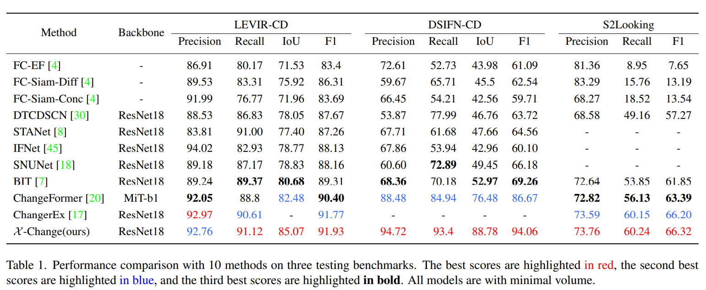
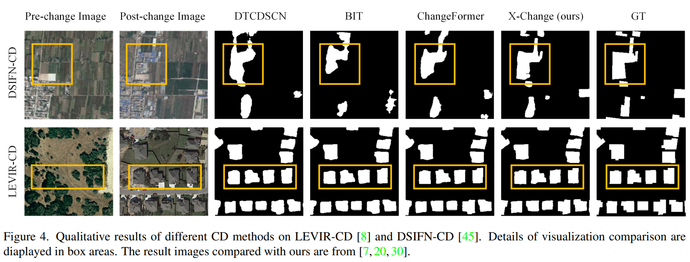

# $\mathcal{X} $-Change: Cross-Attention Transmits Relevance in Remote Sensing Change Detection

## :speech_balloon: Network Architecture


 ## :speech_balloon: Quantitative & Qualitative Results on LEVIR-CD, DSIFN-CD and S2Looking





## :speech_balloon: Requirements

```
Python==3.8
PyTorch==1.12
torchvision==0.13
apex==0.01
```

Please see `requirements.txt` for all the other requirements.

You can create a virtual `conda` environment with the following command:

```bash
conda create -n {env_name} -f {path_of_requirements.txt}
conda activate {env_name}
```

## :speech_balloon: Installation

Clone this repository:

```bash
git clone https://github.com/RSChangeDetection/X-Cross.git
cd X-Cross
```

## :speech_balloon: Quick Start on LEVIR

You can download the processed [`LEVIR-CD-256`](https://www.dropbox.com/sh/lnjxpflvgjijwoj/AAAgWr3xgOjqtTWPVpbLVcfNa?dl=0). 

Our $\mathcal{X}$-Change pretrained model weights are available at  [`Google Driver`](https://drive.google.com/file/d/1tYtNvAz2BUaIPwDBJy2_ylSjY97Ov2z5/view?usp=sharing). 

After downloading the pretrained model, you should change `--checkpoint_path`

Then, start with running LEVIR dataset testing as follows:

```bash
python test.py
```

After that, you can find the detection results in `result`

## :speech_balloon: Train on LEVIR

We initialize the parameters of model's backbone with model pre-trained on ImageNet,  $i.e.$ $ResNets$.

You can download the pre-trained model  here: [`ResNet 18`](https://download.pytorch.org/models/resnet18-f37072fd.pth), [`ResNet 34`](https://download.pytorch.org/models/resnet34-b627a593.pth) , [`ResNet 50`](https://download.pytorch.org/models/resnet50-0676ba61.pth), [`ResNet 101`](https://download.pytorch.org/models/resnet101-63fe2227.pth)

Then, put the weight in `checkpoints/saves`

You can find the training script `train_pipeline.sh` in the folder `script`. You can run the script file by `bash script/train_pieline.sh` in terminal.

Details of `train_pieline.sh` are as follows:

```bash
#! /bin/bash
cd ..
python train.py --epoch={_epoch_num_} --lr={_learning_rate_} --root='data/{_dataset_}/'
python train.py --epoch={_epoch_num_} --lr={_learning_rate_} --enable_x_cross --resume --checkpoint_path='checkpoints/run/**.pth' --root='data/{_dataset_}/'
```

## :speech_balloon: Train on DSIFN and S2Looking

Follow the similar procedure mentioned for LEVIR. Run `train_pipeline.sh`  to train on DSIFN or S2Looking after modifying `lr`、`root`, and the items you are supposed to change can be found in the paper.  

**Note:** There may also exists some parameters need you to modify following the `train_pipeline.sh`. Please make sure you have modified all these parameters properly.

 ## :speech_balloon: Evaluate on LEVIR

We have some samples from [`LEVIR-CD`](https://justchenhao.github.io/LEVIR/) dataset in `test_samples` for a quick start. 

You can find the evaluation script file `sample_test.sh` in the folder `script`. You can run the bash file in terminal to test the samples we provided:

```bash
bash sample_test.sh
```

**Note:** You should download the [`weights`]()  first, and modify the `sample_test.sh` before you run it.

Details of `sample_test.sh` are as follows:

```bash
#! /bin/bash
cd ..
python test.py --save_result --save_iou_map --root='test_samples/' --checkpoint_path='checkpoints/saves/**.pth'
```

## Evaluate on DSIFN and S2Looking

Follow the similar procedure mentioned for LEVIR. Run `sample_test.sh`  to evaluate on DSIFN or S2Looking after modifying `checkpoint_path`, and the items you are supposed to change can be found in the paper.  

**Note:** Samples from the DSIFN and S2Looking databases should be entered by the user as we do not offer weights or samples for these datasets. For testing and evaluation, you must first train your own DSIFN and S2Looking weight.

The warning in training is also need to be noted.

## :speech_balloon: Dataset Preparation

### :point_right: Data Structure

```
"""
Datasets of Change Detection
├————train
|      ├———A  
|      ├———B
|      ├———label
|
├————val
|      ├————...
|
├————test
|      ├————...
"""
```

Your dataset are wished to be like this, and you can turn the organization to this according to label file  `**.txt` , $\bold{or}$ you can modify `change_dataloader.py` in `change` and `train.py`  to adapt to your datasets organization style.

`A` means the directory of pre-changed images

`B` means the directory post-changed images

`label` means the directory of change masks

## :speech_balloon: License

Code is released for non-commercial and research purposes **only**. For commercial purposes, please contact the authors.
